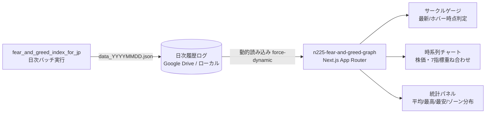

# n225-fear-and-greed-graph 📈

日経平均（Nikkei 225）版「恐怖と強欲指数 (Fear & Greed Index)」の蓄積された日次履歴データを時系列チャートとして可視化し、統計的な分析インサイトを提供する Next.js ダッシュボードアプリケーションです。

---

## 📌 概要

本プロジェクトは、姉妹プロジェクトである **[`fear_and_greed_index_for_jp`](../fear_and_greed_index_for_jp)** が日次バッチで記録したログデータ（`data_YYYYMMDD.json`）を自動的に集約し、日経平均株価の推移や7つの構成指標と重ね合わせて分析できる高機能な履歴ダッシュボードを提供します。



---

## ✨ 主な特徴

- 📈 **高機能インタラクティブ時系列チャート**:
  - `Recharts` による美しいグラデーションエリアチャート（総合スコア推移）
  - **日経平均株価 (N225)** の折れ線チャート同時プロット
  - 期間切り替え（`1M` / `3M` / `ALL`）
  - ホバー時の詳細データツールチップ＆メーター連動
- 🎛️ **7つの構成指標の重ね合わせトグル**:
  - 各算出要素（Market Momentum, Stock Price Strength, Stock Price Breadth, Margin Trading, Junk Bond Demand, Volatility, Safe Haven Demand）を個別にオン/オフしてグラフ上に重畳表示可能
- 📊 **ヒストリカル統計インサイト**:
  - 選択期間内の **平均スコア・最高値（記録日）・最安値（記録日）**
  - **センチメントゾーン滞在日数分布**（Extreme Fear / Fear / Neutral / Greed / Extreme Greed の滞在日数と割合プログレスバー）
- 🔄 **柔軟なデータソース統合**:
  - Google Drive マウントディレクトリまたはローカルフォールバックディレクトリから自動読み込み
  - リクエストごとの動的リロード（`force-dynamic`）

---

## 🏗️ システム要件 & 技術スタック

- **フレームワーク**: [Next.js 16](https://nextjs.org/) (App Router, Server Components & Client Components)
- **UI / スタイリング**: [React 19](https://react.dev/), [Tailwind CSS v4](https://tailwindcss.com/), [Lucide React](https://lucide.dev/)
- **チャートライブラリ**: [Recharts 3.9](https://recharts.org/) (`ComposedChart`, `Area`, `Line`)
- **データ取得・補正**: Node.js, `yahoo-finance2`

---

## 🚀 セットアップ & 実行方法

### 1. パッケージのインストール
```bash
cd n225-fear-and-greed-graph
npm install
```

### 2. データソースの準備
本アプリは以下の優先順位で日次ログファイル（`data_YYYYMMDD.json`）を走査します:
1. **Google Drive マウント**: `/mnt/chromeos/GoogleDrive/MyDrive/Linuxファイル/`
2. **ローカルフォールバック**: `../fear_and_greed_index_for_jp/public/log`

> **Note**: ローカル環境で実行する場合は、同階層の `fear_and_greed_index_for_jp` で `node scripts/fetchData.js` を実行してログを生成しておくか、Google Drive上のログを参照可能な状態にしてください。

### 3. 開発用サーバーの起動
```bash
npm run dev
```
ブラウザで [http://localhost:3000](http://localhost:3000) にアクセスします。

### 4. 本番ビルド & 起動
```bash
npm run build
npm start
```

---

## 🛠️ データメンテナンス用スクリプト (`scripts/`)

過去のログデータに対して指標の再計算や欠損補間を行うためのユーティリティスクリプトが用意されています。

| スクリプト | コマンド | 説明 |
| :--- | :--- | :--- |
| **価格履歴更新** | `node scripts/update-history-prices.js` | Yahoo Financeから日経平均終値を再取得し、ログ内の株価データを更新 |
| **JPX指標更新** | `node scripts/update-history-jpx.js` | `nikkei225jp.com` から騰落レシオ・新高値安値を再取得して再計算 |
| **信用データ更新** | `node scripts/update-history-margin.js` | 信用評価損益率データを再取得してログに反映 |
| **VIデータ更新** | `node scripts/update-history-vi.js` | 日経平均VI（ボラティリティ指数）を再取得して再計算 |
| **欠損日データ補間** | `node scripts/interpolate-missing-dates.js` | 欠損している日付のログを前後のデータから線形補間して生成 |

> **Note**: これらのスクリプトは `/mnt/chromeos/GoogleDrive/MyDrive/Linuxファイル/` 内のログを対象として実行されます。

---

## 📁 ディレクトリ構成

```text
n225-fear-and-greed-graph/
├── public/
├── scripts/
│   ├── interpolate-missing-dates.js  # 欠損日の補間
│   ├── update-history-jpx.js         # JPX指標の再取得・更新
│   ├── update-history-margin.js      # 信用評価損益率の再取得・更新
│   ├── update-history-prices.js      # 日経平均株価の再取得・更新
│   └── update-history-vi.js          # 日経VIの再取得・更新
├── src/
│   ├── app/
│   │   ├── layout.js                 # ルートレイアウト
│   │   ├── page.js                   # ログ集約・データ整形 (Server Component)
│   │   └── globals.css               # グローバルスタイル
│   └── components/
│       └── Dashboard.js              # メインチャート・統計ダッシュボード (Client Component)
└── package.json
```

---

## 🔗 関連プロジェクト

- **[`fear_and_greed_index_for_jp`](../fear_and_greed_index_for_jp)**:
  日経平均および東証プライム市場のデータから「恐怖と強欲指数」を日次バッチで算出し、最新状態を表示するメインアプリ。
